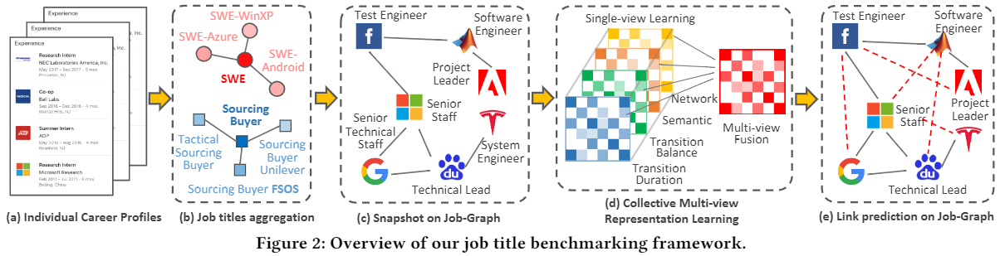
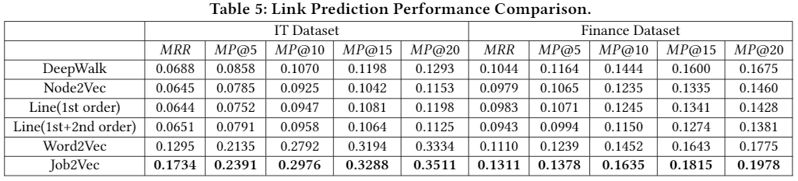

# Job2Vec: Job Title Benchmarking with Collective Multi-View Representation Learning

This repository contains code for our ACM International Conference on Information and Knowledge Management (CIKM) paper: [Job Title Benchmarking with Collective Multi-View Representation Learning](https://github.com/zdh2292390/Job2Vec-Job-Title-Benchmarkingwith-Collective-Multi-View-Representation-Learning/blob/master/presentation/CIKM19_job2vec.pdf) (Job2Vec). Job Title Benchmarking (JTB) aims at matching job titles with similar expertise levels across various companies. We aggregate all the records to construct a large-scale Job Title Benchmarking Graph (Job-Graph), where nodes denote job titles affiliated with specific companies and links denote the correlations between jobs.

We reformulate the JTB as the task of link prediction over the Job-Graph that matched job titles should have links. 
Along this line, we propose a collective multi-view representation learning method (Job2Vec) by examining the Job-Graph jointly in

(1) graph topology view (the structure of relationships among job titles),

(2) semantic view (semantic meaning of job descriptions), 

(3) job transition balance view (the numbers of bidirectional transitions between two similar-level jobs are close)

(4) job transition duration view (the shorter the average duration of transitions is, the more similar the job titles are)

We fuse the multi-view representations in the encode-decode paradigm to obtain an unified optimal representations for the task of link prediction. Finally, we conduct extensive experiments to validate the effectiveness of our proposed method. 

<div align="center">
    
</div>


<div align="center">
    
</div>


## Running the code
The code is MATLAB code works in Ubuntu system.

## Authors
Welcome to send us Emails if you have any questions about the code and our work :-)
* **Denghui Zhang** [Website](https://www.linkedin.com/in/denghui-zhang-112140a5/)
* **xxx** [Website](http://allanding.net/)
* **Lichen Wang** [Website](https://sites.google.com/site/lichenwang123/)


## Citation
This code is corresponding to our CIKM 2019 paper below:
```
@ARTICLE{LTS_Lichen_TIP18, 
  author={Lichen Wang and Zhengming Ding and Yun Fu}, 
  journal={IEEE Transactions on Image Processing}, 
  title={Low-Rank Transfer Human Motion Segmentation}, 
  year={2019}, 
  volume={28}, 
  number={2}, 
  pages={1023-1034},
  doi={10.1109/TIP.2018.2870945},
}
```
Please cite our paper if you like or use our work for your research, thank you very much!


